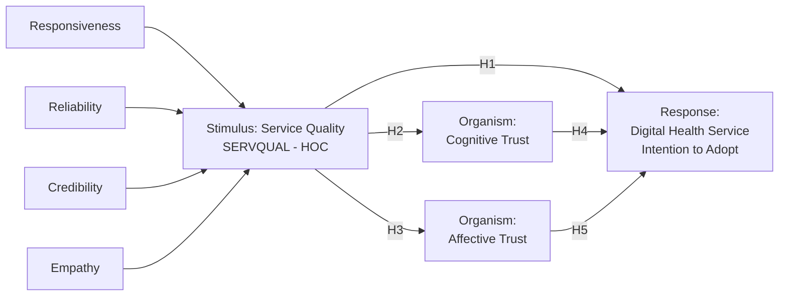

# Analisis Adopsi Chatbot WhatsApp

Repositori ini berisi data, skrip R, dan hasil analisis untuk penelitian adopsi
layanan kesehatan digital berbasis chatbot WhatsApp. Model penelitian menggunakan
kerangka **Stimulus–Organism–Response (S–O–R)** dengan kualitas layanan
(**SERVQUAL**) sebagai stimulus, kepercayaan sebagai organism, dan niat adopsi
sebagai response.

## Model Konstruk Penelitian



Konstruk **Service Quality** merupakan *higher-order construct* (HOC) yang
dibentuk oleh empat dimensi atau *lower-order construct* (LOC):

| Peran | Konstruk | Kode item |
|---|---|---|
| Stimulus (LOC) | Responsiveness | RS1–RS4 |
| Stimulus (LOC) | Reliability | RL1–RL4 |
| Stimulus (LOC) | Credibility | CR1–CR4 |
| Stimulus (LOC) | Empathy | EM1–EM4 |
| Stimulus (HOC) | Service Quality / SERVQUAL | Dibentuk oleh RS, RL, CR, dan EM |
| Organism | Cognitive Trust | CT1–CT4 |
| Organism | Affective Trust | AT1–AT4 |
| Response | Digital Health Service Intention to Adopt | ITA1–ITA5 |

## Hipotesis Penelitian

- **H1:** Service Quality berpengaruh terhadap Digital Health Service Intention
  to Adopt.
- **H2:** Service Quality berpengaruh terhadap Cognitive Trust.
- **H3:** Service Quality berpengaruh terhadap Affective Trust.
- **H4:** Cognitive Trust berpengaruh terhadap Digital Health Service Intention
  to Adopt.
- **H5:** Affective Trust berpengaruh terhadap Digital Health Service Intention
  to Adopt.

## Isi Folder

- `questioner.csv`: data utama penelitian.
- `pre_test_questioner.csv`: data untuk analisis pre-test.
- `analisis_pre_test.r`: analisis kelayakan instrumen pada tahap pre-test.
- `overall_main_test_analysis.r`: ringkasan analisis utama per konstruk.
- Skrip R lainnya: analisis deskriptif, reliabilitas, validitas, korelasi,
  factorability, dan analisis faktor.
- Berkas `.csv` dan `.png`: hasil keluaran dari skrip analisis.

## Menjalankan Analisis

Jalankan skrip R dari folder ini. Setiap skrip mendeteksi lokasi berkasnya
sendiri, membaca data yang relevan, menampilkan hasil analisis, dan menyimpan
keluaran ke folder yang sama.

Contoh:

```powershell
Rscript overall_main_test_analysis.r
```
